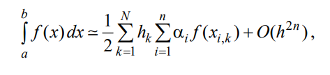
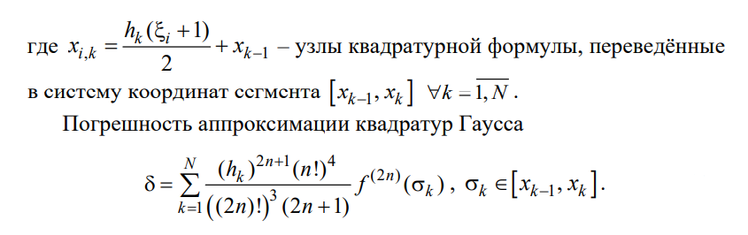
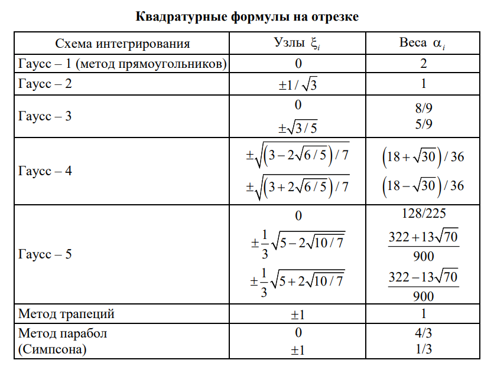

# Численное интегрирование

В данном проекте реализуются методы численного интегрирования для вычисления
определенного интеграла.  
  
**Различают следующие методы:**
- Метод прямоугольников (Гаусс-1)
- Семейство формул Ньютона-Котесса:
    - Метод трапеций
    - Метод парабол (Симпсона)
- Квадратуры Гаусса

## Реализация

---

Так как отрезок интегрирования будет разбит на точки, то используем
структуру **Point** с тремя координатами.  
"Схема" для вычисления интеграла на основе узлов (Points), весов(Weight) и с указанием типа.  
Реализует интерфейс IntegrationSchemeInterval методом CalculateIntegral. 

```go
package main

type Point struct {
  X, Y, Z float64
}

type IntegrationScheme struct {
	Points  []Point
	Weight  []float64
	IntegrationSchemeType string
}

type IntegrationSchemeInterval interface {
    CalculateIntegral(Begin *Point, End *Point, NumberOfSegments int, Func func(point *Point) float64) float64
}
```
---

## Вычисления

**Квадратурная формула Гаусса принимает вид:**





Метод CalculateIntegral для IntegrationScheme вычисляет, используя квадратурную формулу,  
а также соответствующие узлы и веса для данной схемы интегрирования (метода).
---
by Mikhail Rogalsky.